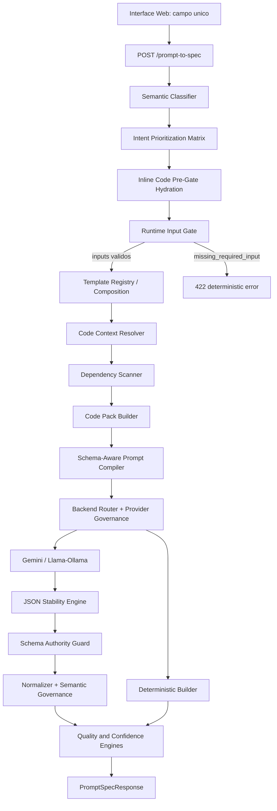

# MCP Harness Task Manager

Nome curto do pacote local: `mcp-task`.

Aplicacao fullstack local que converte prompts, codigo, JSON ou contexto em SPECs estruturadas, usando um runtime semantico governado com Gemini, Llama/Ollama, validacao rigida de schema, injecao de contexto de codigo e fallback deterministico.

Este README e a fonte unica de documentacao do projeto. Documentos antigos de setup, exemplos, summaries e ADRs foram consolidados aqui para evitar informacao duplicada ou desatualizada.

## Visao Geral

O MCP Prompt Generator nao e um chatbot aberto. Ele funciona como um compilador de SPECs: recebe uma solicitacao em linguagem natural, classifica a intent, seleciona um template, coleta contexto de codigo quando disponivel e produz uma estrutura `PromptSpecResponse` validada.

Principio central:

> A estrutura da SPEC pertence ao sistema. A LLM apenas preenche conteudo dentro de campos permitidos.

O runtime atual inclui:

- classificacao semantica e hierarquica de intents;
- priorizacao entre `code_refactor`, `code_analysis`, `api_design`, `frontend_component`, `security_analysis` e outras intents;
- runtime input gate antes da chamada de LLM;
- hidratacao pre-gate com codigo inline colado no prompt;
- extracao de snippets markdown, TypeScript, JavaScript e JSON;
- injecao de contexto real do workspace quando arquivos relevantes existem;
- prompt compiler consciente de schema;
- guardas contra override estrutural da LLM;
- pipeline de JSON estrito;
- governanca de providers e fallback deterministico;
- suite golden de regressao.

## Principais Funcionalidades

- **Campo unico de entrada**: o usuario cola prompt, codigo, JSON ou contexto no mesmo textarea.
- **Classificacao semantica**: detecta dominio, tarefa, risco e intent final.
- **Intent prioritization**: verbos como analisar, refatorar, revisar e proteger influenciam a resolucao entre intents proximas.
- **Confidence gap handling**: quando duas intents ficam proximas, o runtime aplica uma resolucao segura.
- **Runtime Input Gate**: bloqueia com `422` quando uma intent exige dados obrigatorios e eles nao existem.
- **Inline Code Pre-Gate Hydration**: extrai codigo do prompt antes do gate e preenche `inputs.code`.
- **Inline Code Extraction**: cria arquivos virtuais como `inline_prompt_1.ts` ou `inline_prompt_1.json`.
- **Code Context Injection**: seleciona arquivos do workspace, dependencias e snippets inline para montar `CODE_CONTEXT`.
- **Input Field Inference Guard**: impede que stopwords como `esse`, `para` e `quero` criem campos tecnicos indevidos.
- **Schema-Aware Prompt Compiler**: injeta contrato tipado, exemplo valido e regras negativas no prompt da LLM.
- **Strict Contract Enforcement**: a LLM deve retornar somente `{ "content": { ... } }`.
- **JSON Stability Engine**: remove fences markdown, extrai JSON, tenta reparos permitidos e classifica erros.
- **Schema Authority Guard**: rejeita chaves proibidas como `schema`, `intent`, `template`, `prompt_spec` e `metadata`.
- **Provider governance**: separa erros de modelo, quota, auth, timeout e resposta malformada.
- **Model failover**: troca modelos Gemini quando um modelo configurado esta indisponivel.
- **Fallback deterministico**: usa template seguro por intent quando providers falham.
- **Golden tests**: validam classificacao, fallback, runtime gate, JSON, schema e contexto inline.

## Fluxo de Arquitetura



## Fluxo de Execucao

1. O usuario informa tudo no campo unico: pedido, codigo, JSON ou contexto.
2. O frontend envia esse conteudo como `prompt`.
3. O backend normaliza a request e inicia tracing/logs estruturados.
4. O classificador detecta dominio, verbo, risco e intent semantica.
5. Se a intent exigir codigo, o pre-gate tenta extrair codigo inline do proprio prompt.
6. O runtime gate bloqueia apenas quando nao ha campo explicito nem codigo inline suficiente.
7. O sistema seleciona o template da SPEC e preserva campos definidos pelo template.
8. O code context resolver procura arquivos reais relacionados e mescla snippets inline.
9. O code pack builder monta um `CODE_CONTEXT` compacto com limite de tokens.
10. O schema-aware prompt compiler gera um prompt content-only com contrato tipado.
11. Gemini ou Llama/Ollama recebe apenas instrucao para preencher conteudo.
12. A resposta da LLM passa pelo JSON stability engine.
13. O schema authority guard impede override estrutural.
14. O sistema injeta o conteudo no schema controlado pelo template.
15. A SPEC e normalizada, validada e pontuada.
16. Se um provider falhar, o fallback deterministico usa template seguro por intent.
17. A API retorna `PromptSpecResponse` com backend, fallback, qualidade, validacao e metadados.

## Interface

O frontend fica em `public/` e usa React via CDN. `index.html` e apenas o shell da pagina; a logica da UI fica em `app.js` e os estilos base ficam em `styles.css`. A tela principal contem:

- um textarea unico para prompt, codigo ou contexto;
- seletor de backend de IA;
- checkbox de modo estrito;
- botao `Gerar Spec`;
- status de conexao com o backend;
- painel de resultado JSON;
- historico local em `localStorage`.

Payload principal enviado ao backend:

```json
{
  "prompt": "texto completo do usuario, incluindo codigo se houver",
  "preferred_backend": "auto",
  "strict_mode": false,
  "user_id": "user_001",
  "team_id": "team_001"
}
```

Valores aceitos para backend:

- `auto`
- `gemini`
- `llama`
- `ollama`
- `deterministic_builder`

## Exemplo de Uso

Cole tudo no campo unico:

```ts
refatore esse codigo para melhorar a legibilidade

function processarUsuarios(users: any[]) {
  let resultado: any[] = [];
  return resultado;
}
```

Com esse input, o backend deve:

- classificar como `code_refactor`;
- detectar codigo inline;
- criar um arquivo virtual como `inline_prompt_1.ts`;
- preencher `inputs.code` com `code_source: "inline_prompt"`;
- satisfazer o runtime gate;
- injetar `CODE_CONTEXT` no prompt enviado ao provider;
- gerar uma SPEC de refatoracao seguindo o template `code_refactor`.

## Resposta Esperada

A resposta segue o contrato `PromptSpecResponse`. Exemplo resumido:

```json
{
  "status": "success",
  "prompt_spec": {
    "task_instruction": "Create a refactor plan...",
    "input_fields": {},
    "output_fields": {}
  },
  "quality_score": 9,
  "quality_breakdown": {
    "structural_quality": 9,
    "semantic_precision": 8,
    "intent_match": 8,
    "template_fit": 8,
    "provider_execution_quality": 8
  },
  "validation": {
    "is_valid": true,
    "issues": [],
    "fixes_applied": []
  },
  "ai_backend": {
    "provider": "gemini",
    "model": "gemini-2.5-flash",
    "fallback_used": false
  },
  "fallback": {
    "used_fallback": false,
    "fallback_type": "none"
  }
}
```

Para `code_refactor`, os outputs esperados incluem:

- `refactor_plan`
- `module_boundaries`
- `compatibility_notes`
- `tests`

Para `code_analysis`, os outputs esperados incluem:

- `strengths`
- `good_practices`
- `weaknesses`
- `improvement_opportunities`
- `maintainability_score`
- `summary`

## API

Endpoint principal:

```http
POST http://localhost:3000/prompt-to-spec
Content-Type: application/json
```

Request minimo:

```json
{
  "prompt": "crie uma spec para endpoints de uma API REST",
  "preferred_backend": "auto",
  "strict_mode": true
}
```

Cenarios comuns de backend:

```json
{
  "ai_backend": {
    "provider": "gemini",
    "model": "gemini-2.5-flash",
    "fallback_used": false
  }
}
```

```json
{
  "ai_backend": {
    "provider": "ollama",
    "model": "llama3.2",
    "fallback_used": false
  }
}
```

```json
{
  "ai_backend": {
    "provider": "deterministic_builder",
    "model": "template-compiler",
    "fallback_used": true
  },
  "fallback": {
    "used_fallback": true,
    "fallback_type": "intent_specific",
    "fallback_reason": "provider_timeout"
  }
}
```

Quando falta input obrigatorio, a API retorna erro deterministico:

```json
{
  "status": "error",
  "error_code": "missing_required_input",
  "message": "Field 'code' is mandatory for code_refactor intent.",
  "intent": "code_refactor",
  "required_fields": ["code"]
}
```

## Estrutura de Pastas

```text
public/
  index.html                  Shell HTML da interface web estatica
  app.js                      Logica React da UI
  styles.css                  Estilos base da pagina
  backend-config.json          Arquivo gerado pelo backend com porta ativa

src/
  index.ts                     Bootstrap do servidor
  server/                      App Express, porta, backend config e startup
  routes/                      Rotas /prompt-to-spec, /health, /metrics e config
  middleware/                  Handlers de erro e 404
  runtime/                     Estado runtime compartilhado do servidor
  services/
    promptSpecService.ts       Orquestracao principal da geracao de SPEC
  ai/
    classifier/                Catalogo, scoring, priorizacao e classificacao hierarquica
    json/                      Sanitizacao, extracao, reparo e retry de JSON
    prompt/                    Schema-aware prompt compiler
    providers/                 Startup probe, failover e execucao de providers
    router/                    Classificador semantico e grafo de execucao
  cache/
    semantic/                  Cache semantico e politica de escrita segura
    embeddings/                Embeddings locais e similaridade
  learning/
    history/                   Historico persistente e padroes aprendidos
  context/
    inlineCodeExtractor.ts     Extrai codigo colado no prompt
    codeContextResolver.ts     Seleciona arquivos relevantes
    dependencyScanner.ts       Mapeia imports e relacoes por nome
    codePackBuilder.ts         Monta CODE_CONTEXT com limite de tokens
    codeContextMerger.ts       Mescla arquivos reais e virtuais
  governance/
    providers/                 Estado, taxonomia e confiabilidade de providers
    policies/                  Politicas de execucao
    safety/                    Validacao de seguranca
  spec/
    templates/                 Registry, composicao e fallback seguro
    contracts/                 Schema authority e validadores de contrato
    governance/                Runtime gate, semantic governance e hydration
    confidence/                Calculo de confianca
    learning/                  Guardrails para aprendizagem
    builder/                   Construcao deterministica de SPEC
    planner/                   PlanDocument deterministico
  schemas/
    promptSpec.ts              Schemas Zod de request/response
  observability/
    logger.ts                  Logs estruturados
    metrics.ts                 Metricas em memoria
    tracing.ts                 Contexto de tracing
  tests/
    golden/goldenRunner.ts     Suite golden de regressao
```

## Como Rodar

Instale dependencias:

```bash
npm install
```

Crie o `.env`:

```bash
cp .env.example .env
```

Inicie backend e frontend juntos:

```bash
npm run dev
```

Por padrao:

- backend: `http://localhost:3000`
- frontend: `http://localhost:5173`
- health: `http://localhost:3000/health`
- endpoint principal: `POST http://localhost:3000/prompt-to-spec`

O backend escreve `public/backend-config.json` para o frontend descobrir a porta ativa.

## Como Rodar com Docker

O container de producao sobe a API e a UI estatica no mesmo processo Express.

Build manual:

```bash
docker build -t mcp-task .
```

Run manual:

```bash
docker run --rm -p 3000:3000 --name mcp-task mcp-task
```

Com Docker Compose:

```bash
docker compose up --build
```

Se a porta `3000` ja estiver ocupada:

```bash
HOST_PORT=3010 docker compose up --build
```

No PowerShell:

```powershell
$env:HOST_PORT="3010"; docker compose up --build
```

Depois acesse:

- app: `http://localhost:3000`
- health: `http://localhost:3000/health`
- endpoint principal: `POST http://localhost:3000/prompt-to-spec`

Se voce usou `HOST_PORT=3010`, troque `3000` por `3010` nas URLs acima.

O `docker-compose.yml` monta estes arquivos locais dentro do container para preservar o comportamento offline-first:

```text
./.mcp-task -> /app/.mcp-task
./promptSpecHistory.json -> /app/promptSpecHistory.json
```

Variaveis de ambiente podem ser passadas pelo shell antes de iniciar o Compose:

```bash
PREFERRED_BACKEND=deterministic_builder docker compose up --build
```

Para usar Gemini, defina `GEMINI_API_KEY` fora do repositorio. Para usar Ollama instalado no host, use `USE_OLLAMA=true` e mantenha `OLLAMA_HOST=http://host.docker.internal:11434`.

## CLI Local

Depois do build, a CLI local fica disponivel em `dist/cli/mcp-task.js` e o pacote expoe o binario `mcp-task` para uso local futuro.

Comandos suportados:

```bash
npm run build
node dist/cli/mcp-task.js status
node dist/cli/mcp-task.js doctor
node dist/cli/mcp-task.js --help
```

`status` le `.mcp-task/` diretamente e mostra sprint atual, Contract, QA, Evaluation, Done gate, memoria local e comandos de ferramenta. Ele nao precisa do servidor HTTP.

`doctor` valida pre-condicoes locais: runtime Node, `package.json`, metadata do pacote, scripts essenciais, `.mcp-task/` e roadmap.

`start` reaproveita o servidor local existente:

```bash
node dist/cli/mcp-task.js start
```

Esta sprint prepara estrutura local de pacote. Nao ha publicacao npm, release automation, cloud sync ou instalador desktop.

## MVP Local

O MVP local do MCP Harness Task Manager usa arquivos em `.mcp-task/` como fonte operacional. O fluxo principal suportado e:

```text
SPEC -> Contract -> Build -> QA -> Evaluation -> Done
```

Capacidades prontas no MVP:

- shell visual estilo IDE para navegar artefatos locais;
- leitura e edicao controlada de SPECs, sprint plans e Contracts;
- gate de Contract antes de Build;
- QA e Evaluation com score minimo para liberar Done;
- execution harness com comandos propostos, aprovados e auditados;
- memoria local e historico pesquisavel em Markdown/JSON;
- CLI local `mcp-task` para `status`, `doctor`, `help` e `start`;
- persistencia offline-first baseada em `.mcp-task/`.

## Limitações do MVP

O MVP nao inclui:

- SaaS, usuarios, times, billing ou cloud sync;
- banco de dados, vector database ou embeddings;
- publicacao npm real;
- instalador desktop;
- execucao automatica de comandos;
- colaboracao em tempo real;
- sandbox avancado de sistema operacional.

Essas ausencias sao deliberadas para manter o produto local, barato e auditavel.

## Validação Local

Antes de considerar o MVP saudavel, rode:

```bash
node --check public/app.js
npm run build
npm run test:golden
node dist/cli/mcp-task.js status
node dist/cli/mcp-task.js doctor
node dist/cli/mcp-task.js --help
```

O readiness report do MVP fica em:

```text
.mcp-task/evaluations/sprint-010-mvp-readiness.json
.mcp-task/docs/mvp-readiness.md
```

## Scripts Disponiveis

Scripts reais do `package.json`:

```bash
npm run backend          # tsx watch src/index.ts
npm run frontend_static  # serve public -l 5173
npm run frontend         # alias para frontend_static
npm run fullstack        # backend + frontend_static com concurrently
npm run dev              # alias para fullstack
npm run build            # compila TypeScript com tsc
npm run test:golden      # build + suite golden
npm start                # executa dist/index.js
npm run cli              # executa dist/cli/mcp-task.js apos build
```

## Variaveis de Ambiente

Exemplo esperado:

```bash
GEMINI_API_KEY=your_gemini_api_key_here
GEMINI_MODEL=gemini-2.5-flash

USE_OLLAMA=true
OLLAMA_MODEL=llama3.2
OLLAMA_HOST=http://localhost:11434

LLAMA_TIMEOUT_MS=12000
GEMINI_TIMEOUT_MS=25000
LLAMA_MAX_OUTPUT_TOKENS=1024
GEMINI_MAX_OUTPUT_TOKENS=2048

PREFERRED_BACKEND=auto
PORT=3000
```

Notas:

- `GEMINI_API_KEY` e necessario para usar Gemini.
- `GEMINI_MODEL` pode ser validado no startup e trocado por failover se estiver indisponivel.
- `USE_OLLAMA=true` habilita Llama/Ollama local quando o Ollama estiver rodando.
- Nunca coloque chaves reais no README ou em commits.

## Setup do Ollama

Instale o Ollama pelo site oficial:

```text
https://ollama.ai/download
```

Baixe um modelo:

```bash
ollama pull llama3.2
```

Modelos uteis:

- `llama3.2`: equilibrio entre velocidade e qualidade;
- `mistral`: bom para tarefas gerais;
- `codellama`: focado em codigo.

Verifique modelos instalados:

```bash
ollama list
```

Se necessario, inicie o servidor local:

```bash
ollama serve
```

Troubleshooting rapido:

- `model not found`: rode `ollama pull llama3.2`.
- `connection refused`: confirme se `ollama serve` esta ativo e se `OLLAMA_HOST` aponta para `http://localhost:11434`.
- performance lenta: teste um modelo menor ou feche processos pesados de CPU/GPU.

## Testes

Rode a suite golden:

```bash
npm run test:golden
```

Ela cobre:

- classificacao de intents;
- priorizacao de `code_refactor`;
- `code_analysis` em portugues;
- fallback seguro por intent;
- estabilidade de JSON;
- schema authority;
- runtime input gate;
- hidratacao pre-gate com codigo inline;
- input field inference guard;
- code context resolver;
- inline code extraction;
- schema-aware prompt compiler.

Valide tambem o build:

```bash
npm run build
```

## Observabilidade

O backend usa logs estruturados JSON. Eventos importantes:

- `provider_model_validated`
- `provider_error_classified`
- `backend_selected`
- `classification_trace_generated`
- `hierarchical_classification_completed`
- `confidence_gap_detected`
- `inline_code_pre_gate_started`
- `inline_code_pre_gate_hydrated`
- `runtime_gate_satisfied_by_inline_code`
- `contextual_input_missing`
- `input_field_candidate_accepted`
- `input_field_candidate_rejected`
- `code_context_resolution_started`
- `inline_code_detected`
- `code_context_file_selected`
- `code_pack_built`
- `code_context_injected`
- `schema_prompt_compiled`
- `json_sanitization_applied`
- `schema_authority_enforced`
- `fallback_template_selected`

O endpoint `/health` retorna status do backend, providers, modelos e metricas em memoria.

## Decisoes de Arquitetura Consolidadas

- A IA gera conteudo, nao estrutura.
- Template selection e schema definition sao responsabilidade exclusiva do sistema.
- `strict_json` permanece ativo no fluxo governado.
- Erros do usuario, como `missing_required_input`, nao penalizam reliability de provider.
- Retry e bloqueado para erros deterministicos.
- `deterministic_builder` e sempre o ultimo candidato seguro.
- Fallback nunca deve defaultar para `api_design`, `database_design` ou `architecture_design`.
- Codigo inline deve ser hidratado antes do runtime gate quando a intent exige `code`.
- Campos de input definidos pelo template sao preservados.
- Campos inferidos exigem sinal semantico forte, compatibilidade por intent e score minimo.

## Status Atual

Status: runtime funcional em desenvolvimento local.

Validacoes esperadas antes de publicar ou abrir PR:

```bash
npm run build
npm run test:golden
```

## Roadmap

Proximos passos sugeridos, ainda nao implementados como capacidade completa:

- analise AST-aware para TypeScript/JavaScript;
- embeddings reais para ranking semantico de arquivos;
- memoria de sessao entre requests;
- contexto incremental por projeto;
- metricas historicas por provider;
- UI para visualizar trace, fallback reason e code context selecionado;
- persistencia de metricas fora de memoria;
- testes end-to-end com providers mockados.
